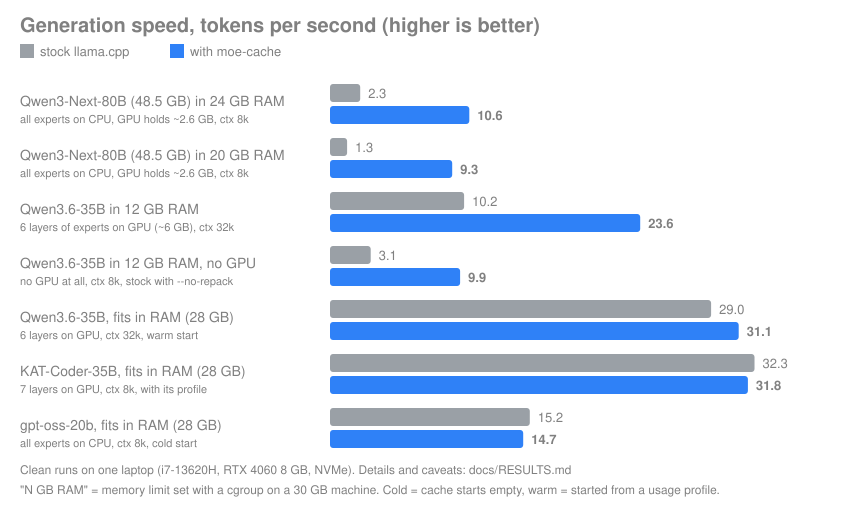

<h1 align="center">moe-cache</h1>

<p align="center"><b>Run Mixture-of-Experts models that are bigger than your RAM, without the speed cliff.</b><br>
A plugin for an unmodified <code>llama-server</code>. No fork, no patch.</p>

<p align="center">


</p>

<p align="center"></p>

## Why

MoE models such as Qwen3, gpt-oss or DeepSeek only use a few "experts" per token, but stock llama.cpp keeps all expert weights in memory-mapped files.
When they do not fit in RAM, the OS page cache thrashes and speed falls off a cliff.

moe-cache manages the CPU-side experts itself:

- keeps the **hot experts in RAM** and reads the rest from your SSD with large, parallel direct reads;
- **sizes its cache from your real memory limit** and stays under it (no out-of-memory kills);
- **learns which experts you use** and warm-starts from that next time (`moe-cache-learn` builds a profile in a minute);
- produces **token-identical output** to stock llama.cpp (checked on every model in [RESULTS](docs/RESULTS.md); one model, Hunyuan, only with a short test);
- works with speculative decoding (MTP), split GGUF files, MXFP4 / K-quants / IQ4_XS / Q5_0, CPU-only machines and Vulkan GPUs;
- runs long prompts on the GPU like stock llama.cpp does.

If the model already fits in your RAM you get stock speed or better (on our hybrid-CPU laptop: +15 % over stock with default settings, the same as stock with hand-tuned CPU pinning, see [RESULTS](docs/RESULTS.md) section 11). It is for the case where it does not.

## Quick start (Linux)

```bash
git clone https://github.com/IbrahimSiddiqui007/moe-cache && cd moe-cache
./build.sh                                   # needs g++ and the libggml-base.so that comes with your llama.cpp
pip install gguf                             # for the automatic GPU/CPU split
tests/identity.sh model.gguf --llama-server /path/to/llama-server     # PASS = same tokens as stock
bin/moe-cache-server model.gguf --ram 12 --llama-server /path/to/llama-server --open
```

`moe-cache-server` plans the GPU/CPU split from your free VRAM, starts `llama-server` with the plugin and opens the built-in web UI
(the same address is an OpenAI-compatible API, so Open WebUI, editors and scripts connect to it). Full guide: [docs/QUICKSTART.md](docs/QUICKSTART.md).

## Results (measured, clean runs)

| Situation | Stock llama.cpp | moe-cache |
|---|---|---|
| 48.5 GB model (Qwen3-Next-80B), 24 GB RAM, ~2.6 GB GPU use | 2.3 tok/s | **10.6 tok/s** |
| Same model, 20 GB RAM | 1.3 tok/s | **9.3 tok/s** |
| Qwen3.6-35B, 12 GB RAM | 10.2 tok/s | **23.6 tok/s** |
| Qwen3.6-35B, 12 GB RAM, **no GPU at all** | 3.1 tok/s | **9.9 tok/s** |
| Long prompt (2.6k tokens), 12 GB RAM, prompt speed | 6 to 8 tok/s (older measurement) | **60 to 62 tok/s** |
| Model fits in RAM (Qwen3.6, 28 GB, warm start) | 29.0 tok/s | 31.1 tok/s |
| Same, with moe-cache's automatic CPU pinning (hybrid Intel CPU), no profile needed | 30.9 tok/s (36.0 if you pin stock by hand) | **35.5 tok/s** |
| Model fits in RAM (KAT-Coder-35B, with its profile) | 32.3 tok/s | 31.8 tok/s |

Conditions: "RAM" is a memory limit set with a cgroup on a 30 GB machine. The 80B model, the 20 GB case and gpt-oss-20b keep **all experts on the CPU** and use the GPU only for the rest of the model (about 2.6 GB). The Qwen3.6 rows put 6 layers of experts on the GPU (about 6 GB), KAT-Coder 7 layers. The "no GPU" row hides the GPU completely. The chart above lists the setup per row.

**Tip for Intel 12th gen and newer laptops (performance + efficiency cores):** pin llama.cpp to one thread per performance core, e.g. `-C 0x555 --cpu-strict 1` on a 6-performance-core CPU (this alone gave stock llama.cpp +15 % decode speed on our laptop; `moe-cache-server` does it for you). Details in [docs/RESULTS.md](docs/RESULTS.md), section 11.

Methods, all numbers and every caveat: [docs/RESULTS.md](docs/RESULTS.md). Hardware for all measurements: Intel i7-13620H, 30 GB RAM, RTX 4060 8 GB, NVMe SSD.

## Hardware and OS support

| Platform | Status |
|---|---|
| Linux + Intel CPU + NVIDIA GPU (CUDA) | **Tested** |
| Linux + Vulkan (NVIDIA, and the Intel integrated GPU) | **Tested**, loaded the official way (`GGML_BACKEND_PATH`) |
| Linux, no usable GPU (CPU only) | **Tested**, identical to stock, within about 4 % of its speed when the model fits |
| Linux + AMD GPU / AMD CPU | Expected to work (same Vulkan path), **not tested on AMD hardware yet** |
| Windows | **Not supported yet.** The code has a Windows layer that compiles with mingw-w64 (`./build.sh --windows`) and passes its tests under Wine, but it has never run on real Windows with llama.cpp |
| macOS | No |

## How it works

```
 llama.cpp builds the graph of the model
          |
  ggml scheduler hands each operation to a backend
          |
   +------+------------------+
   |  GPU backend            |  attention, norms, shared layers, the experts you put on the GPU
   |  CPU backend            |  everything else
   |  moe-cache backend  <-----+  the CPU-side expert matrix multiplications:
   +-------------------------+    1. look at which experts the router picked
                                  2. make sure those experts are in RAM (read the missing ones from the SSD)
                                  3. give back the memory of experts nobody needs (LRU)
                                  4. run llama.cpp's own CPU kernels on them (so results are identical)
```

Each expert keeps its normal address inside one large reserved block of memory; moe-cache decides which experts have real memory behind them.
It plugs into **ggml**, not into llama.cpp's model code, so any model llama.cpp can run through its expert multiplication works.

## Known limitations

- Long prompts (32+ tokens per batch) run their expert blocks on the GPU, as stock llama.cpp does, so prompt processing is at stock speed when the model fits (DeepSeek-V2-Lite: 166 to 183 tok/s vs 166 to 188 stock) and much faster when memory is short.
- It does not manage the GPU; which layers' experts sit in VRAM is chosen once at start by the planner. A GPU expert tier was evaluated and is not built, see [docs/ENGINE_DECISION.md](docs/ENGINE_DECISION.md).
- Needs a llama.cpp with shared ggml libraries; tested with commit `7fe450e19` (ggml 0.25.1). Linux only for now.

## FAQ

**Do I need this if my model fits in RAM?** No. It matches stock speed there (a few percent either way). The gain is when memory is short or the model is larger than your RAM.

**Does it use my GPU?** Yes, through llama.cpp as usual. `moe-cache-server` picks how many layers' experts live on the GPU from your free VRAM (that alone is worth about +60 % over keeping everything on the CPU). moe-cache itself manages the experts that stay on the CPU side.

**Is there a GUI?** `llama-server` already ships a web UI (`moe-cache-server --open`). For a fancier chat app, point [Open WebUI](https://github.com/open-webui/open-webui) at `http://localhost:8080/v1` (OpenAI-compatible API; we have not tested that combination ourselves).

**Why not an own inference engine like Strata or Maya?** Short answer: they are single-model engines with a high hardware floor; moe-cache is a small layer that works with any MoE llama.cpp runs. The reasoning and our measurements: [docs/ENGINE_DECISION.md](docs/ENGINE_DECISION.md).

## Documentation

[Quick start](docs/QUICKSTART.md) | [Results](docs/RESULTS.md) | [Compatibility](docs/COMPATIBILITY.md) | [Roadmap](docs/ROADMAP.md) | [Engine decision](docs/ENGINE_DECISION.md)

## Configuration (environment variables; `moe-cache-server` sets them for you)

| Variable | Meaning |
|---|---|
| `MOE_CACHE_SIZE_GIB` | cache size in GiB, or `auto` (size from the memory limit) |
| `MOE_CACHE_RAM_GIB`, `MOE_CACHE_MARGIN_GIB` | override the detected memory limit; memory to keep free (default 1 GiB) |
| `MOE_CACHE_GGUF` | model file (split models: the first part) |
| `MOE_CACHE_PROFILE` / `MOE_CACHE_WARM` | learn expert usage here and warm-start from it / warm start only |
| `MOE_CACHE_STATS=1` | print hit rate, reads and evictions at exit |
| `MOE_CACHE_DISABLE=1` | load nothing: the server behaves exactly like stock |

## Acknowledgements

- [llama.cpp](https://github.com/ggml-org/llama.cpp) and ggml (MIT, Copyright The ggml authors): moe-cache is a plugin for their backend interface, and it runs their CPU kernels unchanged.
- Related projects with a similar approach (tiering experts across VRAM, RAM and SSD), built as single-model engines: [Strata](https://github.com/Niko1221/Strata) (MIT, by Niko1221) and [Project Maya](https://github.com/mw00/project-maya) (MIT, by mw00).

## License

- moe-cache is MIT-licensed, see [LICENSE](LICENSE).
- `third_party/ggml/` contains interface headers copied from ggml / llama.cpp (MIT, Copyright The ggml authors). Their license text is kept in `third_party/ggml/LICENSE`.
- moe-cache does not include any model weights. Models you run with it keep their own licenses.
- Product and model names (Qwen, gpt-oss, DeepSeek, Granite, Hunyuan, KAT-Coder and others) belong to their owners and are used only to say what was tested.
